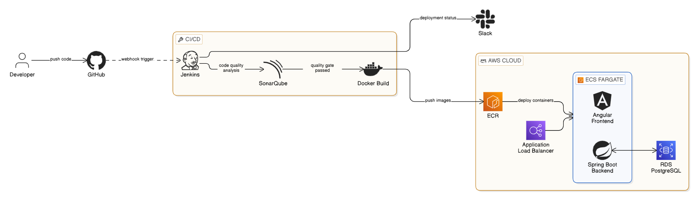

# 🚀 CI/CD Pipeline Full Stack (Angular + Spring Boot) on AWS

## 📌 Overview

This project demonstrates the implementation of a fully automated CI/CD pipeline for a full-stack application built with:

- Angular (Frontend)
- Spring Boot (Backend)

The system is deployed on AWS using modern DevOps practices including Docker, Jenkins, SonarQube, ECS Fargate, and RDS.

The goal is to automate the entire software delivery lifecycle — from code commit to production deployment — ensuring scalability, reliability, security, and continuous delivery.

---

## 🧱 Architecture Overview

### 🔁 CI/CD Flow

GitHub → Jenkins → SonarQube → Docker → AWS ECR → AWS ECS Fargate → AWS RDS → ALB → Users

---

### ⚙️ Pipeline Steps

1. Developer pushes code to GitHub  
2. A webhook triggers the Jenkins pipeline  
3. SonarQube performs static code analysis (Quality Gate)  
4. Docker images are built (frontend & backend)  
5. Images are pushed to AWS ECR  
6. AWS ECS Fargate pulls images and deploys containers  
7. Application connects to AWS RDS (PostgreSQL)  
8. Application is exposed via Application Load Balancer (ALB)  
9. Slack notifications are sent for deployment status  

---

## 🖼️ Architecture Diagram

Add your architecture diagram here:

---

## ⚙️ Tech Stack

### 💻 Frontend
- Angular

### 🧠 Backend
- Spring Boot

### 🚀 DevOps Tools
- Jenkins (CI/CD orchestration)
- SonarQube (Code quality & security analysis)
- Docker (Containerization)

### ☁️ AWS Services
- EC2 (Jenkins server)
- ECS Fargate (Serverless containers)
- ECR (Container registry)
- RDS PostgreSQL (Managed database)
- Application Load Balancer (Traffic routing)

### 🔔 Notifications
- Slack API

---

## 🔄 Infrastructure Details

### 🗄️ Database (AWS RDS)

- PostgreSQL database hosted on AWS RDS
- Cost optimized using snapshot/stop strategy when not in use
- Fully managed service (backup, scaling, maintenance handled by AWS)

---

### 🔐 Security & Credentials

- Database credentials are NOT stored in source code
- Stored securely in ECS Task Definition as environment variables

---

### 🌐 Frontend ↔ Backend Communication

- Angular frontend communicates with backend via ECS service DNS / Load Balancer
- No hardcoded IP addresses are used

---

### 🚀 ECS Services

- Frontend exposed on port 80  
- Backend exposed on port 8081  
- Both deployed on AWS ECS Fargate  

---

### ❤️ Health Check

The backend exposes a health check endpoint:

/health

Used for:
- ECS health checks
- ALB monitoring
- Service availability validation

---

## 🔔 CI/CD Features

- Fully automated pipeline (GitHub → production)
- Dockerized microservices architecture
- Code quality enforcement using SonarQube Quality Gate
- Zero-downtime deployment using ECS Fargate
- Scalable cloud-native infrastructure
- Real-time Slack notifications

---

## 📦 What I Learned

- End-to-end CI/CD pipeline design
- AWS ECS Fargate deployment strategies
- Docker multi-container architecture
- Jenkins declarative pipelines
- SonarQube Quality Gates integration
- AWS cloud infrastructure management
- Secure handling of secrets in cloud environments
- Real-world DevOps workflows

---

## 🚀 Future Improvements

- Infrastructure as Code (Terraform)
- Kubernetes migration (AWS EKS)
- Prometheus + Grafana monitoring
- Automated rollback strategy
- Blue/Green deployment strategy

---

## 🧠 Summary

This project represents a complete DevOps solution including:
- Automated CI/CD pipeline
- Dockerized microservices
- AWS cloud deployment
- Secure credential management
- Scalable and highly available architecture
